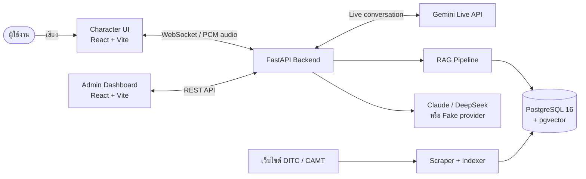

<div align="center">

# DITC CAT

**AI Voice Assistant Character for DITC & CAMT, Chiang Mai University**

ผู้ช่วยอัจฉริยะรูปแบบคาแรกเตอร์แมวสำหรับจอแท็บเล็ตบนหุ่นยนต์<br>
สนทนาด้วยเสียง ค้นคำตอบจากฐานความรู้ และมีระบบหลังบ้านสำหรับดูแลข้อมูลและสถิติ


</div>

> ขอบเขต repository นี้ครอบคลุมเฉพาะซอฟต์แวร์ ไม่รวมกลไก มอเตอร์ หรือระบบควบคุมการเคลื่อนที่ของหุ่นยนต์

## สารบัญ

- [ภาพรวมระบบ](#ภาพรวมระบบ)
- [ความสามารถหลัก](#ความสามารถหลัก)
- [เทคโนโลยี](#เทคโนโลยี)
- [เริ่มต้นใช้งาน](#เริ่มต้นใช้งาน)
- [การตั้งค่า Environment](#การตั้งค่า-environment)
- [คำสั่งที่ใช้บ่อย](#คำสั่งที่ใช้บ่อย)
- [API](#api)
- [โครงสร้างโปรเจกต์](#โครงสร้างโปรเจกต์)
- [การทดสอบ](#การทดสอบ)
- [ข้อควรทราบก่อนนำขึ้น Production](#ข้อควรทราบก่อนนำขึ้น-production)
- [เอกสารเพิ่มเติม](#เอกสารเพิ่มเติม)

## ภาพรวมระบบ

DITC CAT รับเสียงจากผู้ใช้ผ่านหน้า Character UI แล้วส่งต่อด้วย WebSocket ไปยัง FastAPI ซึ่งเชื่อมกับ Gemini Live สำหรับการสนทนาด้วยเสียง และเรียกใช้ RAG เพื่อค้นข้อมูลจริงจากฐานความรู้ของ DITC/CAMT ก่อนตอบกลับ หน้าแมวแสดงสถานะและขยับปากตามเสียงหรือ viseme timeline ที่ได้รับ



| ส่วนประกอบ | หน้าที่ | ค่าเริ่มต้น |
|---|---|---|
| Backend API | REST API, WebSocket voice bridge, RAG, auth และ analytics | `http://localhost:8000` |
| Admin Dashboard | จัดการฐานความรู้ ทดลองแชท และดูสถิติ | `http://localhost:5173` |
| Character UI | หน้าคาแรกเตอร์สำหรับแท็บเล็ตและการสนทนาด้วยเสียง | `http://localhost:5174` |
| PostgreSQL + pgvector | เก็บข้อมูลระบบและเวกเตอร์สำหรับ semantic search | `localhost:5432` |

> `docker-compose.yml` ปัจจุบันรันเฉพาะ PostgreSQL และ Backend ส่วน frontend ทั้งสองตัวรันด้วย Vite แยกกัน

## ความสามารถหลัก

### Voice Character

- สนทนาแบบหลายรอบผ่าน Gemini Live API โดยใช้ WebSocket bridge ที่ `/api/voice/ws`
- รองรับการฟังและตอบแบบ half-duplex เพื่อลดเสียงลำโพงย้อนเข้าไมโครโฟน
- ตรวจจับคำปลุกด้วย Web Speech API และสุ่มเล่นเสียงทักทายที่บันทึกไว้ล่วงหน้า
- แสดงคาแรกเตอร์ 7 สถานะ: sleeping, waking, listening, thinking, speaking, idle และ angry
- ขยับปากด้วยชุด viseme 10 รูปแบบ พร้อม amplitude fallback
- รองรับ Thai G2P viseme timeline แบบ opt-in (`THAI_G2P_ENABLED=false` โดยค่าเริ่มต้น)
- เปลี่ยนเป็นสถานะหลับหลังไม่มีการใช้งาน 5 นาที และตัดรอบสนทนาเมื่อเงียบต่อเนื่อง

### RAG & Knowledge Base

- ดึงเนื้อหาจากเว็บไซต์ CAMT ด้วย HTML crawler และจาก DITC ผ่าน Strapi CMS endpoint
- upsert เอกสารด้วย `content_hash` เพื่อลดงานซ้ำและ re-index เมื่อเนื้อหาเปลี่ยน
- ตัดเอกสารเป็น chunk และสร้าง embedding ด้วย `intfloat/multilingual-e5-large`
- ค้นหาแบบ semantic ด้วย cosine distance บน pgvector/HNSW ร่วมกับ keyword search
- จำกัดบริบทคำตอบให้อยู่ในขอบเขต DITC/CAMT และมี off-topic handling

### Admin Dashboard

- สมัครและเข้าสู่ระบบด้วย JWT
- ดู ค้นหา เพิ่ม แก้ไข เปิด/ปิด และลบเอกสารใน Knowledge Base
- สั่ง sync แหล่งข้อมูลและติดตามสถานะการ index
- ทดลองถามตอบผ่าน text chat พร้อมดูแหล่งอ้างอิง
- ดูสถิติการสนทนาตามช่วงวันที่ หัวข้อ และคุณภาพคำตอบ

### Privacy-aware Analytics

- บันทึก metadata ของ session/turn สำหรับการวิเคราะห์ เช่น เวลา หัวข้อ จำนวนข้อความ และสถานะการค้นฐานความรู้
- ไม่บันทึกไฟล์เสียงหรือข้อความสนทนาดิบลงฐานข้อมูล
- แยกการจบ session จาก WebSocket connection เพื่อรองรับการ reconnect ของบริการเสียง

## เทคโนโลยี

| Layer | Technology |
|---|---|
| Backend | Python 3.13, FastAPI, SQLAlchemy 2, Alembic, Pydantic |
| Database | PostgreSQL 16, pgvector, HNSW index |
| Character UI | React 18, TypeScript, Vite 5, Vitest, Web Audio API |
| Admin UI | React 18, Vite 6, Material UI, Tailwind CSS 4, Recharts |
| Authentication | JWT, bcrypt |
| AI / Voice | Gemini Live API, Claude หรือ DeepSeek สำหรับ text chat |
| Embedding | Sentence Transformers, multilingual-e5-large (1,024 dimensions) |
| Infrastructure | Docker Compose |

## เริ่มต้นใช้งาน

### สิ่งที่ต้องมี

- [Docker Desktop](https://www.docker.com/products/docker-desktop/) พร้อม Docker Compose
- Node.js และ npm รุ่นที่รองรับ Vite 5/6
- API key ตามโหมดที่ต้องการใช้งาน:
  - `GEMINI_API_KEY` สำหรับการสนทนาด้วยเสียง
  - `ANTHROPIC_API_KEY` หรือ `DEEPSEEK_API_KEY` สำหรับ text chat เมื่อไม่ได้ใช้ fake provider
- พื้นที่ว่างสำหรับ image, dependencies และ embedding model (Hugging Face cache ของโมเดลมีขนาดประมาณ 2 GB)

### 1. เตรียม Environment

```powershell
git clone https://github.com/CutieCat8/AI-Chatbot-Character-DITC-.git
cd AI-Chatbot-Character-DITC-
Copy-Item .env.example .env
```

แก้ไข `.env` อย่างน้อยให้มี secret และ API key ที่ต้องใช้ ห้าม commit ไฟล์ `.env` ขึ้น repository

### 2. สร้างฐานข้อมูลและรัน Backend

สำหรับการรันครั้งแรก ให้เปิดฐานข้อมูล รัน migration แล้วจึงเปิด backend:

```powershell
docker compose up -d db
docker compose run --rm backend alembic upgrade head
docker compose up backend
```

ครั้งถัดไปสามารถรันได้ด้วย:

```powershell
docker compose up
```

> ครั้งแรกที่ backend โหลด `multilingual-e5-large` อาจใช้เวลานานตามความเร็วอินเทอร์เน็ต หลังจากนั้นโมเดลจะถูกเก็บใน Docker volume `hf-cache`

ตรวจสอบว่า backend พร้อมใช้งาน:

```text
Health check : http://localhost:8000/health
Swagger UI   : http://localhost:8000/docs
```

### 3. รัน Admin Dashboard

เปิด terminal ใหม่:

```powershell
cd frontend-admin
npm ci
npm run dev
```

เปิด `http://localhost:5173` และสร้างบัญชีครั้งแรกที่ `http://localhost:5173/register`

### 4. รัน Character UI

เปิด terminal ใหม่จาก root ของโปรเจกต์:

```powershell
cd frontend-character
npm ci
npm run dev
```

เปิด `http://localhost:5174` แล้วอนุญาตให้เบราว์เซอร์ใช้ไมโครโฟน หน้าเว็บมีเมนูสำหรับโหมดสนทนาจริง โหมด preview สถานะ และเครื่องมือ debug

การเปิดจากแท็บเล็ตผ่าน LAN ต้องใช้ HTTPS เพื่อให้ `getUserMedia` ทำงาน ดูขั้นตอน certificate และการตั้งค่า IP โดยละเอียดใน [`frontend-character/README.md`](frontend-character/README.md)

## การตั้งค่า Environment

<!-- AUTO-GENERATED: environment variables from .env.example, backend/app/config.py, and frontend source -->

| ตัวแปร | จำเป็นเมื่อ | คำอธิบาย / ค่าที่รองรับ |
|---|---|---|
| `POSTGRES_USER` | รันด้วย Docker | ชื่อผู้ใช้ PostgreSQL |
| `POSTGRES_PASSWORD` | รันด้วย Docker | รหัสผ่าน PostgreSQL; ควรเปลี่ยนก่อนใช้งานจริง |
| `POSTGRES_DB` | รันด้วย Docker | ชื่อฐานข้อมูล |
| `POSTGRES_HOST` | ทุกโหมด | ใช้ `db` ใน Docker หรือ `localhost` เมื่อรัน backend โดยตรง |
| `POSTGRES_PORT` | ทุกโหมด | พอร์ต PostgreSQL; ค่าเริ่มต้น `5432` |
| `APP_ENV` | ไม่บังคับ | `development` หรือ `production` |
| `API_PORT` | ไม่บังคับ | พอร์ต backend; ค่าเริ่มต้น `8000` |
| `CORS_ORIGINS` | frontend คนละ origin | รายการ origin คั่นด้วย comma |
| `JWT_SECRET` | ใช้ Admin auth | secret สำหรับลงลายเซ็น JWT; ต้องเปลี่ยนในระบบจริง |
| `JWT_EXPIRE_MINUTES` | ไม่บังคับ | อายุ token; ค่าเริ่มต้น `1440` นาที |
| `LLM_PROVIDER` | ใช้ text chat | `claude`, `deepseek` หรือ `fake` |
| `ANTHROPIC_API_KEY` | `LLM_PROVIDER=claude` | Anthropic API key |
| `ANTHROPIC_MODEL` | `LLM_PROVIDER=claude` | ชื่อ Claude model |
| `DEEPSEEK_API_KEY` | `LLM_PROVIDER=deepseek` | DeepSeek API key |
| `DEEPSEEK_MODEL` | `LLM_PROVIDER=deepseek` | ชื่อ DeepSeek model |
| `GEMINI_API_KEY` | ใช้ Voice Character | Google Gemini API key |
| `EMBEDDING_PROVIDER` | ทุกโหมด RAG | `e5`, `openai` หรือ `fake`; ค่าเริ่มต้น `e5` |
| `EMBEDDING_MODEL` | `EMBEDDING_PROVIDER=e5` | ค่าเริ่มต้น `intfloat/multilingual-e5-large` |
| `EMBEDDING_DIM` | fake/openai หรือ schema | มิติ vector; schema ปัจจุบันใช้ `1024` |
| `THAI_G2P_ENABLED` | ไม่บังคับ | เปิด Thai G2P viseme timeline; ค่าเริ่มต้น `false` |
| `THAI_G2P_TIMEOUT_MS` | เปิด Thai G2P | timeout ก่อน fallback; ค่าเริ่มต้น `100` ms |
| `SCRAPE_HTML_SEEDS` | ใช้ scraper | seed URL ของ HTML crawler |
| `DITC_STRAPI_BASE` | ใช้ scraper | base URL ของ Strapi CMS |
| `DITC_SITE_BASE` | ใช้ scraper | base URL สำหรับประกอบลิงก์กลับเว็บไซต์ DITC |
| `VITE_API_URL` | Admin UI | REST API base URL; ค่าเริ่มต้น `http://localhost:8000` |
| `VITE_VOICE_WS_URL` | Character UI อยู่คนละ host | WebSocket URL เช่น `wss://192.168.1.50:8000/api/voice/ws`; ถ้าไม่ตั้งจะใช้ hostname ปัจจุบันกับพอร์ต `8000` |

<!-- END AUTO-GENERATED -->

ดูรายการทั้งหมดและค่าเริ่มต้นได้ที่ [`.env.example`](.env.example) และ [`backend/app/config.py`](backend/app/config.py)

## คำสั่งที่ใช้บ่อย

<!-- AUTO-GENERATED: commands from Docker Compose and package.json -->

| ตำแหน่ง | คำสั่ง | หน้าที่ |
|---|---|---|
| root | `docker compose up` | รัน PostgreSQL และ Backend |
| root | `docker compose up --build` | build image ใหม่แล้วรัน backend/database |
| root | `docker compose down` | หยุดและลบ container โดยไม่ลบ named volumes |
| root | `docker compose exec backend alembic upgrade head` | อัปเดต schema ของฐานข้อมูลที่กำลังรัน |
| `backend/` | `python -m pytest -q` | รัน backend test suite |
| `backend/` | `python -m app.scraper.run --json data/scrape.json --to-db` | scrape ทั้งสองแหล่งและบันทึกลงฐานข้อมูล |
| `backend/` | `python -m app.rag.verify` | ตรวจ pgvector, index และ retrieval pipeline |
| `backend/` | `python -m app.scripts.reindex_embeddings` | สร้าง embedding index ใหม่ |
| `frontend-admin/` | `npm run dev` | รัน Admin Dashboard ในโหมดพัฒนา |
| `frontend-admin/` | `npm run build` | สร้าง production bundle ของ Admin Dashboard |
| `frontend-character/` | `npm run dev` | รัน Character UI ในโหมดพัฒนา |
| `frontend-character/` | `npm run build` | type-check และสร้าง production bundle |
| `frontend-character/` | `npm test` | รัน Vitest test suite |
| `frontend-character/` | `npm run preview` | preview production build |

<!-- END AUTO-GENERATED -->

## API

เอกสาร request/response schema แบบ interactive อยู่ที่ `http://localhost:8000/docs`

<!-- AUTO-GENERATED: route summary from backend/app/main.py and backend/app/routers -->

| Method | Endpoint | หน้าที่ | Auth |
|---|---|---|---|
| `GET` | `/` | ข้อมูล service | ไม่ใช้ |
| `GET` | `/health` | ตรวจ backend และ database | ไม่ใช้ |
| `POST` | `/api/auth/register` | สมัครผู้ดูแลระบบ | ไม่ใช้ |
| `POST` | `/api/auth/login` | เข้าสู่ระบบและรับ JWT | ไม่ใช้ |
| `GET` | `/api/auth/me` | อ่านข้อมูลผู้ใช้ปัจจุบัน | Bearer token |
| `POST` | `/api/chat` | ถามตอบผ่าน RAG + text LLM | ไม่ใช้ |
| `GET/POST/PATCH/DELETE` | `/api/documents` | อ่านและจัดการ Knowledge Base | ยังไม่บังคับใน backend |
| `POST` | `/api/documents/sync` | สั่ง scrape และ index เบื้องหลัง | ยังไม่บังคับใน backend |
| `GET` | `/api/stats/conversations` | สถิติการสนทนาตามช่วงวันที่ | Bearer token |
| `WS` | `/api/voice/ws` | Gemini Live voice bridge | ไม่ใช้ |
| `GET` | `/voice-test` | หน้าทดสอบ voice WebSocket | ไม่ใช้ |

<!-- END AUTO-GENERATED -->

## โครงสร้างโปรเจกต์

```text
AI-Chatbot-Character-DITC-/
├── backend/
│   ├── app/
│   │   ├── auth/              # JWT และ password hashing
│   │   ├── llm/               # Claude / DeepSeek / fake clients
│   │   ├── models/            # SQLAlchemy models
│   │   ├── rag/               # chunking, embedding, retrieval, indexing
│   │   ├── routers/           # REST และ WebSocket endpoints
│   │   ├── scraper/           # CAMT crawler และ DITC Strapi client
│   │   ├── services/          # analytics, topic classification, Thai G2P
│   │   └── main.py            # FastAPI entry point
│   ├── alembic/               # Database migrations
│   └── tests/                 # Backend tests
├── frontend-admin/            # Admin Dashboard (React + Vite)
├── frontend-character/        # Character UI (React + TypeScript + Vite)
├── db/init/                   # เปิดใช้งาน PostgreSQL extensions
├── docs/                      # ADR, audit และเอกสารวิเคราะห์
├── experiments/               # งานทดลอง lip-sync / Thai G2P
├── docker-compose.yml
└── .env.example
```

## การทดสอบ

คำสั่งตรวจสอบหลัก:

```powershell
# Backend
cd backend
.\.venv\Scripts\python.exe -m pytest -q

# Character UI
cd ..\frontend-character
npm test
npm run build

# Admin Dashboard
cd ..\frontend-admin
npm run build
```

สถานะที่ตรวจล่าสุดเมื่อ **27 กันยายน 2026**:

| ส่วน | ผลตรวจ |
|---|---|
| Backend | 77 tests passed |
| Character UI | 39 tests passed; production build สำเร็จ |
| Admin Dashboard | production build สำเร็จ |

> Backend tests แสดงเพียง warning ว่า environment ปัจจุบันเขียน `.pytest_cache` ไม่ได้ และ Admin build แสดงคำเตือนว่า JavaScript chunk ใหญ่กว่า 500 kB ทั้งสองกรณีไม่ทำให้ test/build ล้มเหลว

## ข้อควรทราบก่อนนำขึ้น Production

- `POST /api/auth/register` ยังเปิดให้สมัครได้โดยไม่ใช้ invite code
- route จัดการเอกสารและ voice WebSocket ยังไม่ได้บังคับ authentication ที่ backend แม้หน้า Admin จะมี Protected Route
- Docker Compose เป็น configuration สำหรับ development (`uvicorn --reload`) และยังไม่มี frontend service, reverse proxy หรือ TLS termination
- Gemini model ที่ใช้อยู่คือ preview model (`gemini-3.1-flash-live-preview`) จึงควรตรวจชื่อ model และข้อจำกัดของ API ก่อน deploy ทุกครั้ง
- wake-word ใช้ Web Speech API ของเบราว์เซอร์และยังต้องทดสอบความเสถียรระยะยาวบน Samsung Galaxy Tab S10 FE+ ในสภาพแวดล้อมหน้างานจริง
- Thai G2P เป็นฟีเจอร์ทดลองและปิดโดยค่าเริ่มต้น ระบบจะ fallback หาก provider ใช้งานไม่ได้หรือเกิน timeout
- Admin bundle ยังมีคำเตือนเรื่อง chunk ขนาดใหญ่ ควรทำ code splitting ก่อนให้บริการผ่านเครือข่ายที่ช้า
- ควรเปลี่ยน `JWT_SECRET`, รหัสผ่านฐานข้อมูล และค่า secret ตัวอย่างทั้งหมดก่อนเปิดให้เข้าถึงจากภายนอก

## เอกสารเพิ่มเติม

- [`HOW_TO_RUN.md`](HOW_TO_RUN.md) — checklist สำหรับเปิดระบบก่อนพรีเซนต์
- [`frontend-character/README.md`](frontend-character/README.md) — การรันบนแท็บเล็ตผ่าน LAN และ HTTPS
- [`docs/adr/embedding-model.md`](docs/adr/embedding-model.md) — เหตุผลที่เลือก multilingual-e5-large
- [`docs/adr/voice-stt-real-world-test.md`](docs/adr/voice-stt-real-world-test.md) — ผลทดสอบ voice/STT ในสถานการณ์จริง
- [`docs/adr/voice-multiturn-session-bug.md`](docs/adr/voice-multiturn-session-bug.md) — การวิเคราะห์ session หลายรอบ
- [`docs/decisions/ADR-004-lip-sync-technology-selection.md`](docs/decisions/ADR-004-lip-sync-technology-selection.md) — การตัดสินใจด้าน lip-sync
- [`docs/knowledge-base-audit.md`](docs/knowledge-base-audit.md) — audit ฐานความรู้
- [`docs/gap-analysis.md`](docs/gap-analysis.md) — gap analysis ของระบบ

---

<div align="center">
พัฒนาสำหรับศูนย์ DITC คณะ CAMT มหาวิทยาลัยเชียงใหม่
</div>
